# Insights & Recommendation

---

### Problem

Logistic company which is constantly thriving to improve customer experience along with better work environment fo their delivery personals are trying to estimate the delivery time of the order. Through this they can optimize delivery personals and demands efficiently.

### Technical Insights

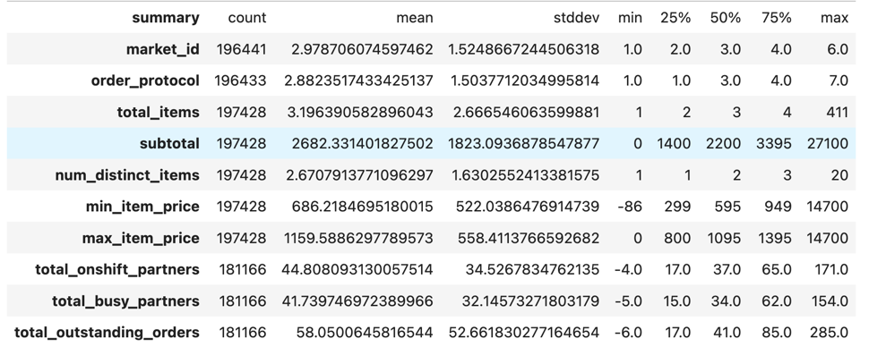
- Observed Negative Values in `item_price`, indicating logging error or a wave off to customer due to logistic issue.
- Negative values in `onshift`, `busy` and `outstanding_ordrers` might indicate extreme end of the minimum business threshold set for each, indicating availability in excess or less.

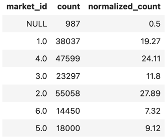
- Most orders are placed from `market_id` 2 & 4

- Common `order_protocol` used to place orders are 1 & 3.

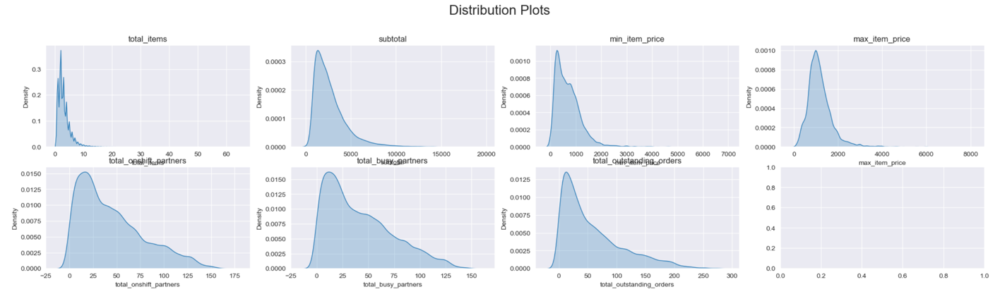
- Most of the Continuous Distributions are Log Normal in Nature

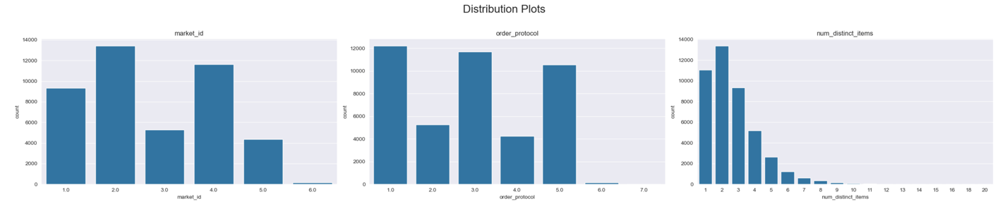
- Customers generally place orders having 1-3 distinct items.

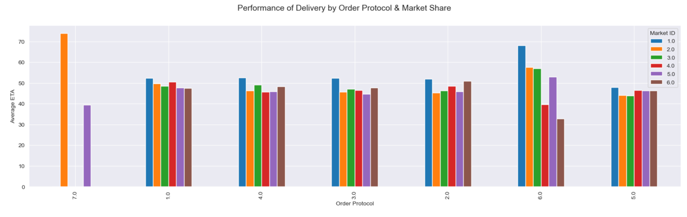
- Not all stores operate for `order_protocal` 7, and those who are operate are from `market_id` 2 & 4, where orders originating from `market_id` 2 takes high time to deliver.

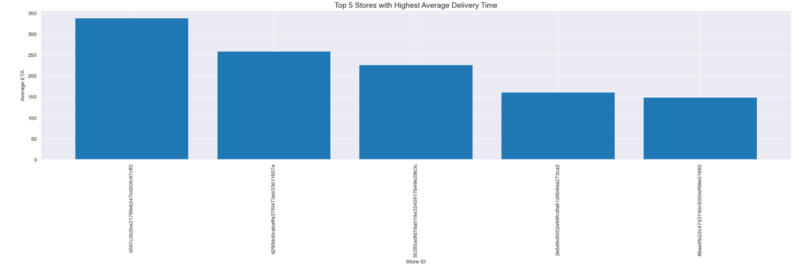
- Stores with average `eta` of 300 minutes needs to be inspected thoroughly.

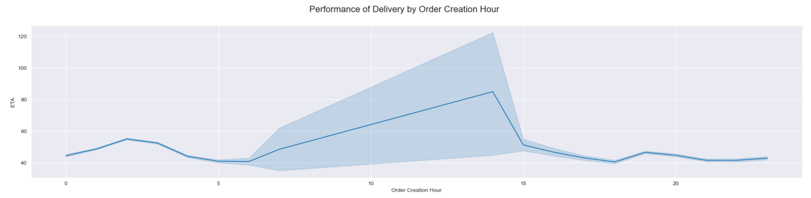
- Order placed during afternoon takes most time to deliver.

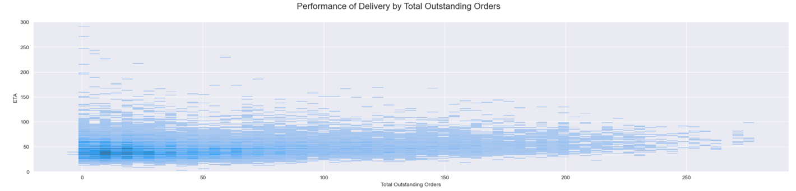
- `eta` is affected due to the high `total_outstaning_orders`.

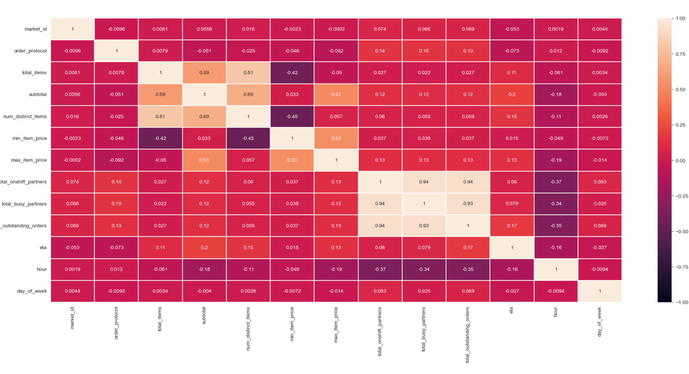
- High correlation observed between partners and outstanding orders.

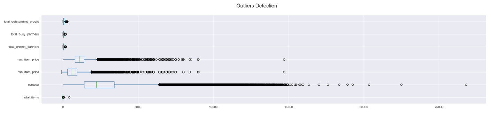
- Outliers observed in `subtotal`, `item_price` and `total_items`. These features generally follow Log Normal Distributions.

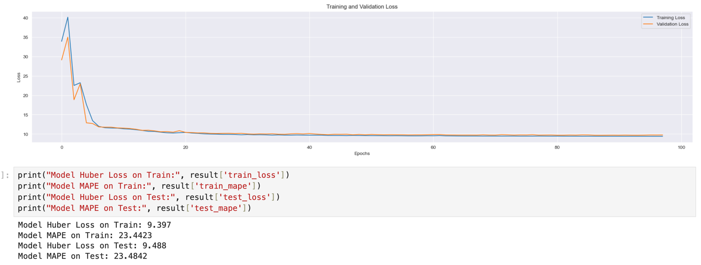
- Our Neural Network model shows a MAPE of 23.6, when compared with classical models, the difference observed is not significant enough. This indicates.
    - Need for more Data, Features (No relevant features synthesized from existing features) to improve model performance.
    - This also indicates that although delivery estimates have some patterns, but is also significantly influenced by external factors.

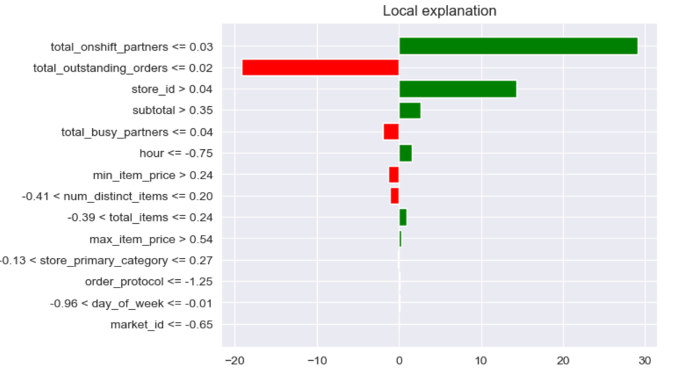
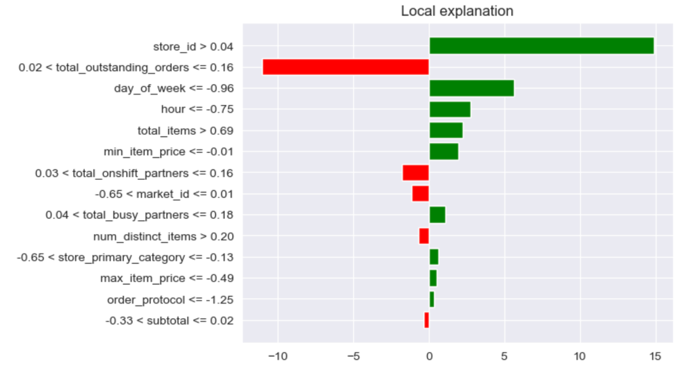
- Most important factors for delivery are partners availability, total outstanding orders, time and cart value.

### Recommendations

- Allocate proper reinforcements for high volume market such as markets with id 1 & 2
- Since a customer generally places an order for 1-3 distinct items, try to optimize delivery process by making the personnel deliver multiple places in 1 go.
- Inspection needs to be made with stores with higher average eta than global.
- Since during afternoon most orders are placed, try to create a dedicated task force for that period, ensuring a balanced delivery partners distribution to meet fluctuating demands.
- Develop smarter algorithm to assign delivery partners as efficiently as possible.
- Inspect why order placed through protocol 7 takes more time to deliver and the popularity in order protocols 1 & 3.
- To improve model performance, try to collect more data and identify additional external factors.